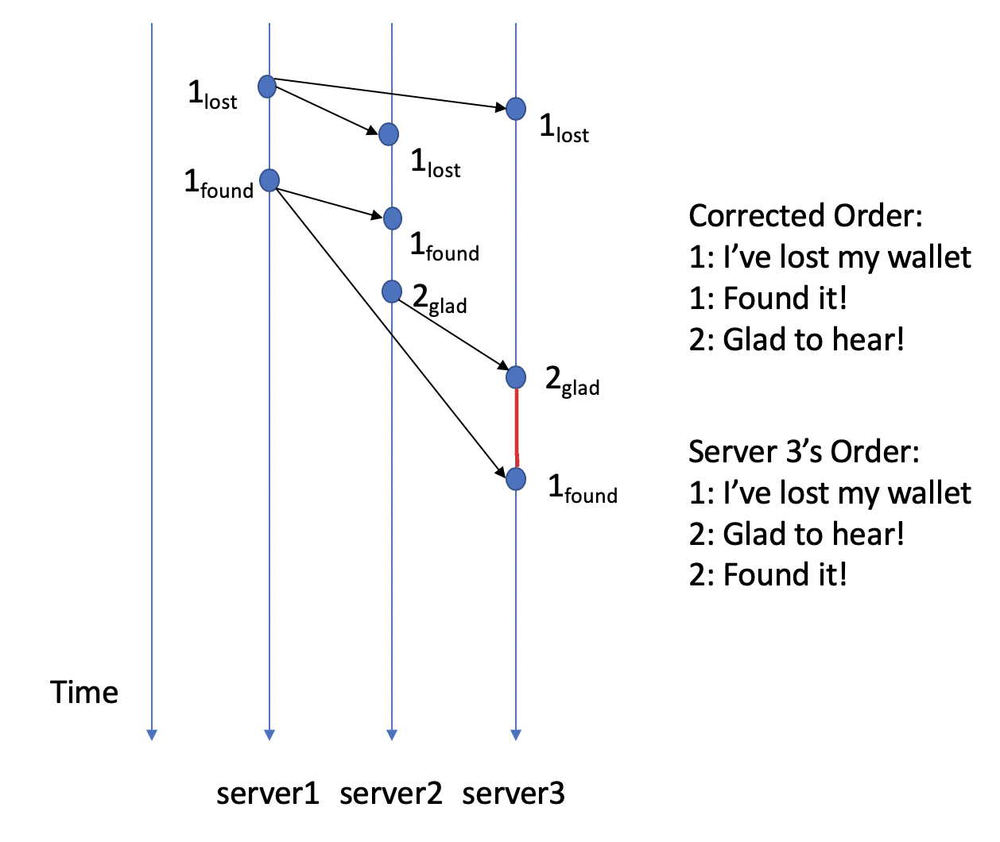

# Causal Consistency Server
When a distributed system is composed of multiple servers/datacenters and multiple clients. It might encounter issues related to ordering. The messages travel through the Internet might arrived replicated servers in unexpected order. If these messages are causal related, the state of the servers would suffer from inconsistency.

The system implemented is aim at solving the problem metioned earlier.  The servers commit replicated requests in causal ordering, this allows distributed system to stay in causal consistency.

## Examples
The following image shows the problem caused by unexpected ordering.



The system enforces causal ordering and prevent the issue shown in the image.

## Download and Compile
1. Clone the repository

    ``` bash
    https://github.com/bchu7796/CausalConsistencyServer.git
    ```

2. Go to the work directory

    ```bash
    cd CausalConsistencyServer/
    ```

3. Compile

    ``` bash 
    make all 
    ```

4. Execute server

    ```bash
    ./server
    ```

5. Execute client

    ```bash
    ./client
    ```
## Commands on the client user interface
1. Read a variable

    ```bash
    read 'key'
    ```

2. Write a variable

    ```bash
    write 'key' 'value' 
    ```

## Test
1. Unzip "test_env.zip"
    ``` bash
    unzip test_env.zip
    ```
2. Go to test_env directory
    ``` bash
    cd test_env
    ```
3. Compile
    ``` bash
    make all
    ```
4. Execute client and server in client_server1/, client_server2/, and client_server3/

5. Emulate the example shown in "Examples" section.
    1. In client1, write lost
        ``` bash
        >write x lost
        ```
    2. In client1, write found
        ``` bash
        >write y found
        ```
    3. In client2, read found
        ``` bash
        >read y
        ```
    4. In client2, write glad
        ``` bash
        >write z glad
        ```
    5. Server3 would delay message z from client2 until it receives message x.

    

## Reference
Penn State CSE 513 fall 2019 LAB 2.
